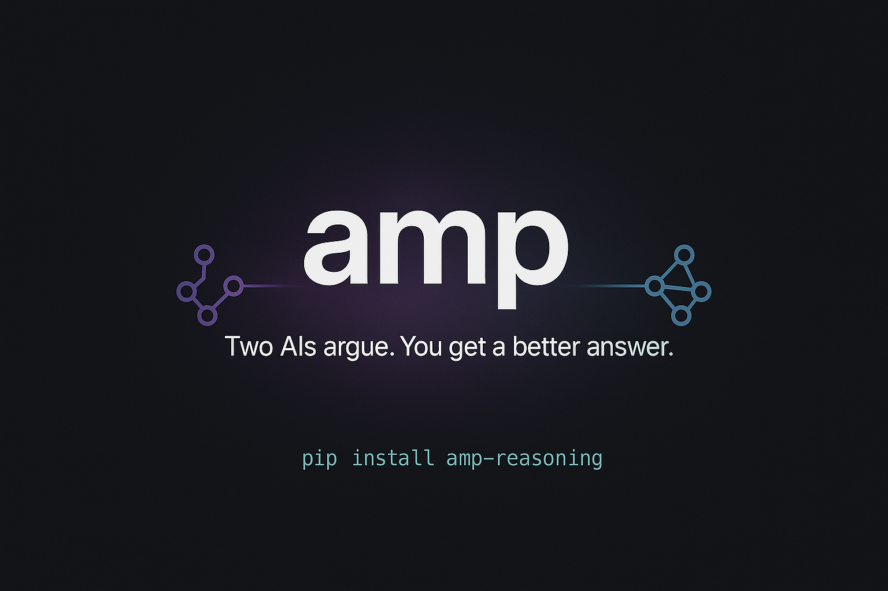
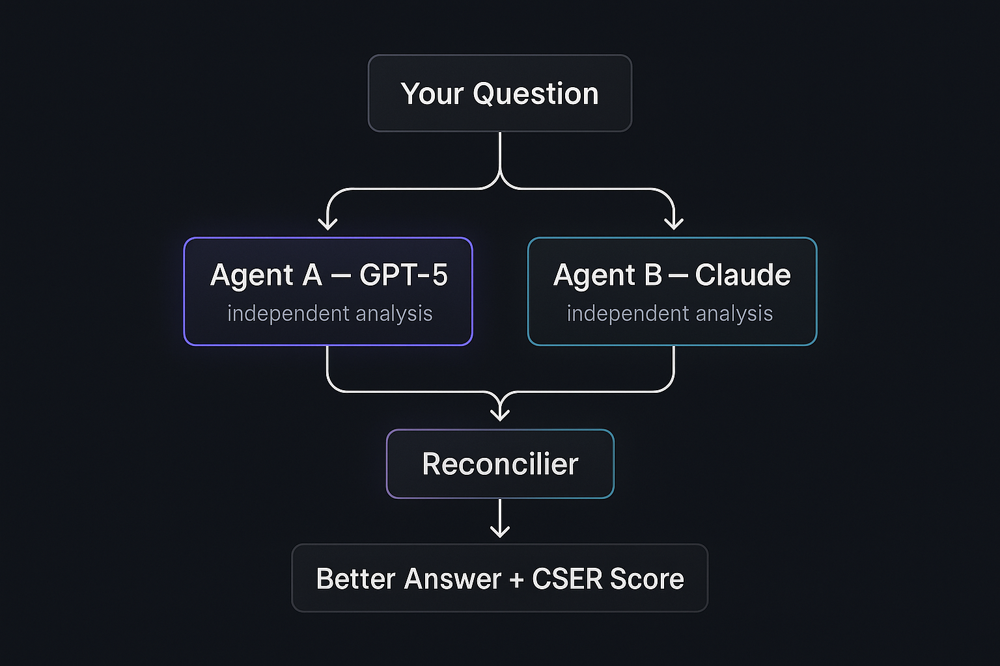

# amp — AI ディベートエンジン

> **2つのAIが議論する。あなたはより良い答えを得る。**

[](https://pypi.org/project/amp-reasoning/)
[](https://python.org)
[](LICENSE)

<div align="center">



</div>


**他の言語で読む:** [English](README.md) · [한국어](README.ko.md) · [中文](README.zh.md) · [Español](README.es.md)

---

## なぜ amp なのか？

1つのAIには盲点があります — 同じデータで訓練され、同じバイアスを持ち、常に「安全な」答えを返します。**ampは2つの独立したAIを並列で実行し、互いに議論させた後、両者の視点を合成してより良い答えを作り出します。**

```
あなたの質問
       │
       ├──────────────────────────────────────┐
       ▼                                      ▼
  Agent A (GPT-5)                      Agent B (Claude)
  [独立した分析]                         [独立した分析]
       │                                      │
       └──────────────┬───────────────────────┘
                      ▼
                 Reconciler（統合器）
                      │
                      ▼
         最終回答  +  CSERスコア
```

**CSER**（Cross-agent Semantic Entropy Ratio）: 2つのAIがどれだけ異なる視点で考えたかを測る指標。高いほど → より独立した思考 → より良い合成。

---

## インストール

```bash
pip install amp-reasoning
amp init        # 対話形式のセットアップ（約1分）
```

**OAuthで無料使用**（APIキー不要 — ChatGPT Plus + Claude Maxサブスクリプション必要）:
```bash
amp login       # ブラウザでOAuth認証
```

**ワンライン インストーラー:**
```bash
curl -fsSL https://raw.githubusercontent.com/dragon1086/amp-assistant/main/install.sh | bash
```

---

## クイックスタート

```bash
# すぐに使う
amp "ビットコインは今買うべき？"
amp "React vs Vue in 2026 — 新プロジェクトはどちらがいい？"
amp "RustとGoの本当のトレードオフは何？"

# 4ラウンドの深いディベート（時間はかかるが深く掘り下げる）
amp --mode emergent "AGIは2028年より前に実現するか？"

# MCPサーバー起動（Claude Desktop、Cursor、OpenClawなど）
amp serve
```

---

## 仕組み

<div align="center">



</div>

### デフォルトモード — 2ラウンド独立分析
Agent AとBが**お互いの答えを見ずに**独立して分析します。
真の独立性を保証 → 高CSER → より良い合成。

### Emergentモード — 4ラウンド構造的ディベート
```
Round 1:  Agent A が分析
Round 2:  Agent B が A の論理に反論
Round 3:  Agent A が B の反論に再反論
Round 4:  Agent B が最終反論
              └──► Reconciler が統合
```

### CSER ゲート
2つのAIが似すぎた意見（CSER < 0.30）の場合、ampは自動的に4ラウンドディベートに
エスカレートし、より多様な視点を強制的に引き出します。

---

## 設定

```bash
amp init   # 対話形式ウィザード
amp setup  # 詳細設定（モデル、Telegramボット、プラグイン）
```

または `~/.amp/config.yaml` を直接編集:

```yaml
agents:
  agent_a:
    provider: openai
    model: gpt-5.2             # gpt-5.2 | gpt-5.4 | gpt-5.4-mini
    reasoning_effort: high     # none | low | medium | high | xhigh

  agent_b:
    provider: anthropic        # ANTHROPIC_API_KEY があれば最速
    model: claude-sonnet-4-6

amp:
  parallel: true      # Agent A+B を並列実行（デフォルト: true、~50%高速化）
  timeout: 90         # エージェントごとのタイムアウト（秒）
  kg_path: ~/.amp/kg.db
```

### プロバイダーオプション

| プロバイダー | 速度 | コスト | 要件 |
|------------|------|--------|------|
| `openai` | ⚡⚡⚡ | 有料 | `OPENAI_API_KEY` |
| `openai_oauth` | ⚡⚡⚡ | **無料** | ChatGPT Plus/Pro + `amp login` |
| `anthropic` | ⚡⚡⚡ | 有料 | `ANTHROPIC_API_KEY` |
| `anthropic_oauth` | ⚡⚡ | **無料** | Claude Max/Pro + `amp login` |
| `gemini` | ⚡⚡⚡ | 有料 | `GEMINI_API_KEY` |
| `deepseek` | ⚡⚡⚡ | 安価 | `DEEPSEEK_API_KEY` |
| `mistral` | ⚡⚡⚡ | 安価 | `MISTRAL_API_KEY` |
| `local` | ⚡⚡ | 無料 | Ollama 実行中 |

**完全無料の組み合わせ（ChatGPT Plus + Claude Maxサブスクリプション）:**
```bash
amp login
# → openai_oauth × anthropic_oauth を自動設定
# → APIコスト $0
```

---

## MCPサーバー

Claude Desktop、Cursor、OpenClawなどのMCP対応クライアントと連携:

```bash
amp serve   # http://127.0.0.1:3010 で起動
```

MCP設定に追加:
```json
{
  "amp": {
    "url": "http://127.0.0.1:3010"
  }
}
```

| ツール | 説明 | 典型的なレイテンシ |
|--------|------|-----------------|
| `analyze` | 2ラウンド独立分析 | 15–30秒 |
| `debate` | 4ラウンド構造的ディベート | 30–60秒 |
| `quick_answer` | 単一LLM高速回答 | ~3秒 |

---

## Docker

```bash
docker run \
  -e OPENAI_API_KEY=sk-... \
  -e ANTHROPIC_API_KEY=sk-ant-... \
  -p 3010:3010 \
  ghcr.io/dragon1086/amp-assistant

# docker-compose を使用
OPENAI_API_KEY=sk-... ANTHROPIC_API_KEY=sk-ant-... docker-compose up
```

---

## Python API

```python
from amp.core import emergent
from amp.config import load_config

config = load_config()
result = emergent.run(
    query="バックエンドにRustとGoどちらを使うべき？",
    context=[],
    config=config,
)

print(result["answer"])
print(f"CSER:    {result['cser']:.2f}")       # 2つのAIの意見の差
print(f"合意点:  {result['agreements']}")
print(f"相違点:  {result['conflicts']}")
```

---

## パフォーマンス（2026-03、Apple Mシリーズ、並列モード）

| 構成 | 平均レイテンシ | クエリあたりコスト |
|------|-------------|----------------|
| GPT-5.2 + Claude Sonnet（API、並列） | ~18秒 | $0.03–0.08 |
| GPT-5.2 + Claude OAuth（並列） | ~35秒 | ~$0.01 |
| GPT-5.2 + GPT-5.2（同一ベンダー） | ~15秒 | $0.02–0.05 |

並列A+B実行により、逐次実行比**~50%高速化**（v0.1.0+）。

---

## なぜクロスベンダーなのか？

GPTとClaudeは異なる会社が、異なるデータで、異なるアラインメント手法で訓練しました。同じ質問に対して本当に異なる意見を持つ可能性が高い。これがampのコアインサイト — **クロスベンダー合成は、単一ベンダーの自己ディベートよりも優れた答えを生み出します。**

---

## コントリビュート

```bash
git clone https://github.com/dragon1086/amp-assistant
cd amp-assistant
pip install -e ".[dev]"
pytest tests/ -q
```

大きな変更はまずIssueを作成してください。PRは歓迎します。

---

## ライセンス

MIT © 2026 amp contributors
