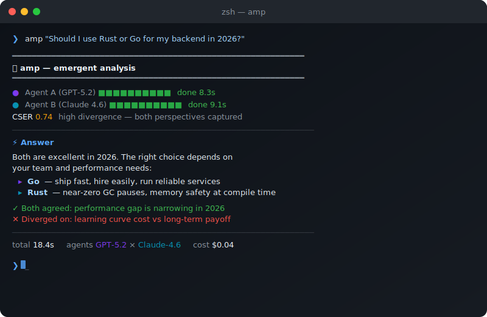

<div align="center">


<h3>두 AI가 싸운다. 당신은 더 나은 답을 얻는다.</h3>

[](https://pypi.org/project/amp-reasoning/)
[](https://python.org)
[](LICENSE)

**[왜 amp인가](#왜-amp인가--그냥-api-두-번-호출이-아닌-이유)** · **[설치](#설치)** · **[작동 원리](#작동-원리)** · **[벤치마크](#벤치마크)** · **[설정](#설정)**

<br/>

**다른 언어:** [English](README.md) · [日本語](README.ja.md) · [中文](README.zh.md) · [Español](README.es.md)

</div>

---

## 왜 amp인가 — 그냥 API 두 번 호출이 아닌 이유

"LLM 두 개 부르고 합치면 되는 거 아냐?" 같아 보이지만, 같지 않습니다.

### 문제 1 — 순차 토론은 앵커링 편향을 만든다

대부분의 멀티 에이전트 시스템은 이렇게 작동합니다:

```
Agent A 답변 → Agent B가 A의 답변을 읽음 → Agent B 응답
```

Agent B가 A의 출력을 본 순간, B는 A의 프레임, 어휘, 가정에 닻을 내립니다. B의 "비판"은 A의 구조로 수렴합니다 — 반박처럼 보여도 한 개의 사고방식처럼 추론합니다.

**amp의 해법 — 독립성 불변식:** 2-라운드 모드에서 A와 B는 병렬로 실행되며 서로의 출력을 *절대* 보지 않습니다. 독립성은 프롬프트 지시가 아니라 아키텍처로 강제됩니다.

```
질문 ──┬──► Agent A  [격리]  ──► 분석 A
       └──► Agent B  [격리]  ──► 분석 B
                      │
                      ▼
               Reconciler 합성
               (두 출력이 처음으로 함께 보이는 순간)
```

### 문제 2 — 같은 벤더 모델은 진정한 독립이 아니다

GPT-4 + GPT-4를 다른 프롬프트로 쓰면 어휘 중복이 높습니다. 훈련 데이터, RLHF 정렬, 사전 분포가 공유됩니다 — 다양성은 대부분 표면적입니다.

**amp의 해법 — 동일 벤더 다양성 엔진:** amp는 두 에이전트가 같은 벤더인지 자동으로 감지합니다. 같은 벤더이면 도메인별 극단적 반대 페르소나와 다른 온도를 부여합니다:

| 도메인 | Agent A 페르소나 | Agent B 페르소나 | 온도 |
|--------|-----------------|-----------------|------|
| `investment` | 퀀트 리스크 애널리스트 — 하방 보호, 통계 | 모멘텀 성장 투자자 — 비대칭 수익, 추세 | 0.3 / 1.1 |
| `business` | 리스크 관리 CFO — 현금흐름, 보수적 성장 | 비전형 창업가 — 시장 파괴, 10배 성장 | 0.3 / 1.1 |
| `career` | 커리어 최적화 전략가 — 데이터, 위험 최소화 | 파괴적 혁신 코치 — 비선형 도약, 편안함 거부 | 0.3 / 1.1 |
| `ethics` | 의무론적 윤리학자 — 원칙, 절대적 규범 | 공리주의 실용주의자 — 결과 중심, 맥락 유연 | 0.3 / 1.1 |

총 9개 도메인. 교차 벤더 쌍(GPT × Claude)은 이 처리를 건너뜁니다 — 다양성이 구조적이기 때문입니다.

### 문제 3 — "더 나은 답변"은 측정하지 않으면 검증 불가능

합성이 실제로 더 나았는지 어떻게 알 수 있을까요? 지표 없이는 추측입니다.

**amp의 해법 — CSER (Cognitive Synthesis Emergence Rate):**

```
CSER = (unique_insights_A + unique_insights_B) / total_insights
```

CSER은 전체 인사이트 풀에서 *각 에이전트에게만* 고유한 것의 비율을 측정합니다. CSER = 1.0은 모든 인사이트가 한 에이전트에서만 나왔다는 것(최대 발산), CSER = 0.0은 두 에이전트가 같은 말을 했다는 것(에코챔버)을 의미합니다.

- **CSER ≥ 0.30** → 합성 진행 (경험적으로 보정된 임계값 θ)
- **CSER < 0.30** → amp가 자동으로 4-라운드 토론으로 심화하여 더 많은 발산을 강제

이것이 게이트입니다. 없으면 창발이 일어났는지 비싼 에코챔버인지 알 수 없습니다.

### 문제 4 — OpenAI와 Anthropic은 이걸 만들 수 없다

교차 벤더 합성 — GPT가 Claude에 맞서 분석하는 것 — 이 제품의 핵심 메커니즘입니다. OpenAI는 Anthropic을 인정하는 기능을 출시하지 않을 것입니다. Anthropic도 OpenAI를 인정하는 기능을 출시하지 않을 것입니다. 중립적인 오픈소스 프로젝트만이 둘을 동등하게 놓고 진정한 경쟁을 시킬 수 있습니다.

이건 부수적인 특징이 아닙니다. amp가 오픈소스로 존재해야 하는 이유입니다.

---

## 작동 원리

<div align="center">


</div>

### 2-라운드 — 병렬 독립 분석 (기본)

1. **자동 페르소나:** 쿼리 도메인을 감지(9개 카테고리, LLM 폴백)하고 각 에이전트에게 대조적인 전문가 페르소나를 부여
2. **병렬 실행:** A와 B가 교차 가시성 없이 동시에 실행
3. **CSER 측정:** Jaccard 유사도로 추출된 아이디어 단위의 고유/공유 인사이트 계산
4. **게이트:** CSER < θ면 4-라운드로 자동 심화
5. **합성 + 검증:** 세 번째 LLM 호출로 합의점, 충돌점, 최종 답변 합성
6. **KG 업데이트:** 질문, 합성, CSER 점수를 가중 엣지(`PRODUCES`, weight = CSER)와 함께 로컬 지식 그래프에 저장

### 4-라운드 — 구조적 토론 (emergent 모드)

```
Round 1 ── Agent A 분석
Round 2 ── Agent B가 A의 논리에 반박     (B에게 A의 출력이 처음 공개됨)
Round 3 ── Agent A가 B의 반박에 재반론
Round 4 ── Agent B 최종 반박
                │
                ▼
       Reconciler가 모든 라운드 합성
```

### 지식 그래프 — 시간이 지날수록 진화하는 합성

KG(`~/.amp/kg.db`)는 정적 지식 베이스가 아닙니다. 모든 합성은 CSER 점수와 함께 노드로 저장됩니다. 질문→합성 엣지의 가중치가 CSER 자체입니다:

```python
kg.relate(question_id, synthesis_id, "PRODUCES", weight=cser)
```

나중에 관련 질문을 하면 amp는 의미론적으로 유사한 과거 합성을 검색(OpenAI 임베딩 + 코사인 유사도)하여 컨텍스트로 주입합니다. KG는 **성장하는 도메인 지능 레이어**입니다 — 사용할수록 당신의 특정 도메인에서 더 정확해집니다.

---

## 벤치마크

블라인드 A/B 평가: amp ON vs 단일 GPT-5.2. Gemini가 무작위 레이블로 판사 역할 (모델 신원 미공개). N=30 질문, 7개 도메인.

| 도메인 | amp 승 | Solo 승 | amp 승률 |
|--------|:------:|:-------:|:--------:|
| resource_allocation | 4 | 1 | **80%** |
| strategy | 4 | 2 | **67%** |
| emotion | 3 | 2 | 60% |
| career | 0 | 3 | 0% |
| relationship | 1 | 4 | 20% |
| ethics | 1 | 4 | 20% |
| **전체 (N=30)** | **13** | **17** | **43%** |

**솔직한 해석:** amp가 항상 더 낫지는 않습니다. 다중 관점이 유효한 복잡한 전략/리소스 배분 문제에서 크게 우세합니다. 단순 경력 조언이나 관계 문제는 단일 전문가 모델도 충분합니다. 빠른 전문가 답변이 필요하면 `amp -m solo`를, 질문에 진정으로 여러 프레이밍이 있으면 `amp`를 사용하세요.

---

## 데모

<div align="center">



*예시 출력. 실제 CSER 및 응답 시간은 쿼리와 제공사에 따라 다릅니다.*

</div>

---

## 설치

```bash
pip install amp-reasoning
```

**방법 1 — API 키** (가장 빠름, 15–25초):
```bash
export OPENAI_API_KEY="sk-..."
export ANTHROPIC_API_KEY="sk-ant-..."
amp init
```

**방법 2 — OAuth 무료** (ChatGPT Plus + Claude Max 구독 필요):
```bash
amp login
```

**방법 3 — 원클릭 설치:**
```bash
curl -fsSL https://raw.githubusercontent.com/dragon1086/amp-assistant/main/install.sh | bash
```

---

## 빠른 시작

```bash
amp "지금 Series A 라운드를 열어야 할까, 런웨이를 연장해야 할까?"
amp "2026년 신규 프로젝트에 React vs Vue — 팀 4명 기준"
amp "이 계약 조항의 실질적 위험은?"

amp -m solo "현재 기준금리가 얼마야?"   # 단일 정답 → solo 추천
amp -m emergent "AGI가 2028년 전에 올까?"  # 4-라운드 심층 토론
amp serve  # MCP 서버 시작
```

---

## 설정

```bash
amp init
```

`~/.amp/config.yaml`:

```yaml
agents:
  agent_a:
    provider: openai
    model: gpt-5.2
    reasoning_effort: high

  agent_b:
    provider: anthropic
    model: claude-sonnet-4-6

amp:
  parallel: true
  timeout: 90
  kg_path: ~/.amp/kg.db
```

> **실제로 가장 높은 CSER:** `openai` × `anthropic` — 서로 다른 조직, 다른 코퍼스, 다른 정렬 방법으로 훈련. 프롬프트 다양성이 아닌 구조적 다양성.

---

## amp를 언제 쓸까

| 질문 유형 | 추천 | 이유 |
|----------|------|------|
| "지금 투자해야 할까?" | `amp` | 여러 유효한 프레임, 고위험 |
| "이 계약서 검토해줘" | `amp` | 적대적 스트레스 테스트 필요 |
| "프랑스 수도는?" | `amp -m solo` | 단일 정답, 토론 낭비 |
| "이 전략의 리스크는?" | `amp` | 맹점 발견에 두 관점 필요 |
| "이 문서 요약해줘" | `amp -m solo` | 검색 작업, 창발 불필요 |

---

## 기여하기

```bash
git clone https://github.com/dragon1086/amp-assistant
cd amp-assistant
pip install -e ".[dev]"
pytest tests/ -q
```

---

## 라이선스

MIT © 2026 amp contributors
